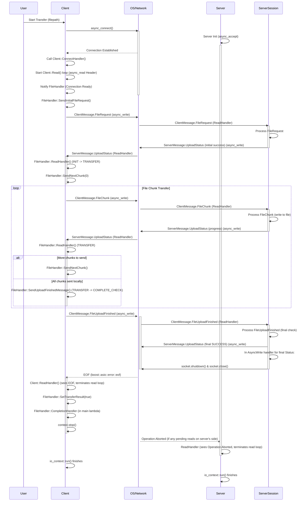

# Asynchronous File Transfer with Boost.Asio

This repository showcases an asynchronous file transfer application built using **Boost.Asio** for TCP/IP communication. It includes both server and client components, where the client transfers a file to the server by packaging data into **Protobuf messages**.

### Install

```bash
mkdir build && cd build
conan install .. -of=. --build=missing -s build_type=Release
source conanbuild.sh
cmake .. -DCMAKE_BUILD_TYPE=Debug -DCMAKE_TOOLCHAIN_FILE=./conan_toolchain.cmake
make
```

### Flow Diagram


